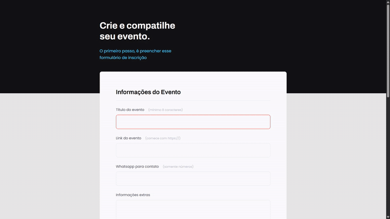

# Projeto 03 - Formulários, Validações e Customizações

> Este projeto é uma página web com Formulários que contém validações dentro do HTML, usando HTML e CSS. Ele foi desenvolvido durante o curso Explorer da Rocketseat, que ensina os fundamentos do desenvolvimento web. O objetivo deste projeto é aprender e aplicar os conceitos de HTML e CSS.

## Funcionalidades

- Input's customizados
- Botão customizado
- Formulário com data e hora
- Validações simples

## Aprendizados

- Input's e Form
- Fieldset junto do Legend
- Validações dentro HTML
- Customização de SELECT

## Stack utilizada

**Front-end:** HTML, CSS
